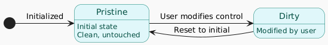
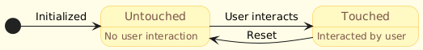
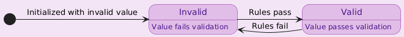

# Angular Renaissance Fundamentals Workshop 17+

In this step, we develop the following component:

**Note: At the time this tutorial/workshop was developed, the forms API did not yet support signals. Therefore, it was implemented using the older API. However, the update will be straightforward. When that time comes, this repository/tutorial/workshop will be updated (or you can submit a Pull Request).**

## Angular Form Control State

The states of Angular form controls describe the status of a form control in Angular forms.

| STATE      | DETAILS                                                                                              | CSS-Class       |
| ---------- | ---------------------------------------------------------------------------------------------------- | --------------- |
| Pristine   | The user has not modified the control                                                               | `.ng-pristine`  |
| Dirty      | The user has modified the control                                                                   | `.ng-dirty`     |
| Touched    | The user has interacted with the control, e.g., `clicking` or `focusing`                            | `.ng-touched`   |
| Untouched  | The user has not interacted with the control                                                        | `.ng-untouched` |
| Valid      | The form control's value matches the validation rules defined in the application                    | `.ng-valid`     |
| Invalid    | The form control's value does not match the validation rules defined in the application             | `.ng-invalid`   |

Official documentation:

- [Documentación de Reactive Forms](https://angular.dev/guide/forms)

## Exercises
To develop the workshop exercises, you should have Angular running in development mode. Use the following npm script:

`npm run serve`

Once running, you can develop and see changes in real-time.

Look for the following TODOs in the source code. If you need the solution, switch to the branch with the `-solved` suffix.

- **TODO 317** (`hero.new.component.ts`) Create an array called `powerstats` that contains the different power stats in an array: `['combat', 'durability', 'intelligence', 'power', 'speed', 'strength']`.
  - (`hero.new.component.html`) Use `@for` to iterate through the abilities (`powerstats`) and repeat the corresponding form fragment for each ability. Remember to use the `titlecase` pipe from the `CommonModule` module to capitalize the validation text.  Check the solution in the branch [02.03-communication-control-flow-solved](https://github.com/puntotech/angular-renaissance-fundamentals-workshop/tree/02.03-communication-control-flow-solved).

Enjoy your coding journey
